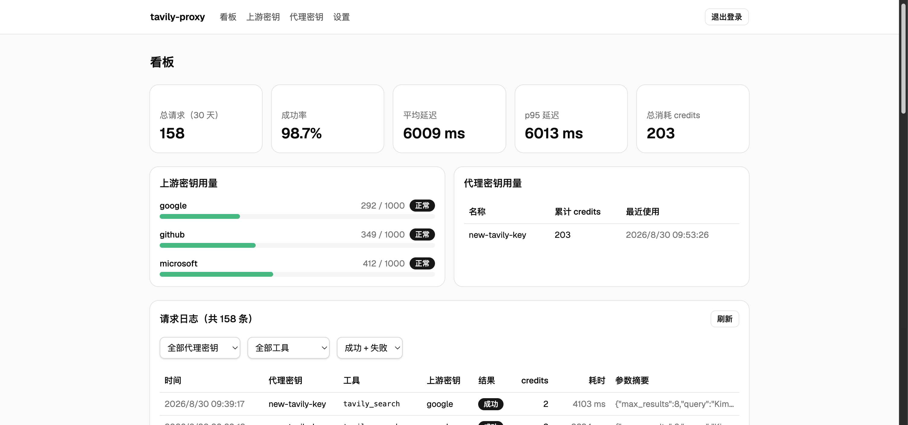
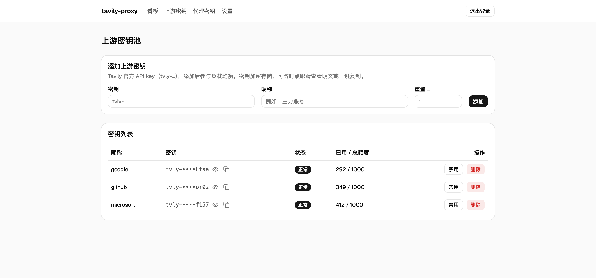

# tavily-proxy

[](https://github.com/ijkzen/tavily-proxy/actions/workflows/ci.yml)

把 Tavily 官方的 [远程 MCP 服务器](https://docs.tavily.com/mcp-server) 变成**自托管版本**：
你自己持有上游密钥池，通过统一的 MCP 端点向外提供 `tavily_search` 等工具，并在多个上游
密钥之间自动选路、限流冷却、额度耗尽切换与请求日志统计。

## 功能特性

- **MCP 端点**：`POST /mcp`（Streamable HTTP），工具名称与参数和官方完全一致，MCP 客户端可零改动接入
- **密钥池**：多个 Tavily 官方密钥（`tvly-...`）统一管理，额度感知选路（有效剩余 credits 最多优先）
- **状态机**：每个上游密钥有 冷却（429 短暂移出）/ 耗尽（432/433 到周期重置）/ 禁用（401 或手动停用）三种健康状态
- **代理密钥**：自签 `tp-...` 密钥，可随时吊销；上游密钥密文存储（AES-GCM）
- **管理界面**：Web 登录（单用户）+ 中文看板——密钥池用量与健康状态、请求日志（保留 30 天）、成功率与延迟统计
- **单二进制**：Rust（axum + sqlx/SQLite）+ 内嵌 React 前端（rust-embed），`FROM scratch` 即可运行

## 界面预览

| 看板（用量与健康状态） | 上游密钥池（额度感知管理） |
| --- | --- |
|  |  |

## 架构

```
MCP 客户端 ──POST /mcp──> tavily-proxy ──REST──> api.tavily.com
   (Claude 等)    Bearer tp-...    │ 额度感知选路、冷却/耗尽/禁用
                                  └──> SQLite（密钥池、日志、会话）
```

- `docs/adr/`：架构决策记录
- `CONTEXT.md`：领域术语表（上游密钥 / 代理密钥 / 密钥池 / 额度 / 健康状态）

## 快速开始

### 前置

- Rust（stable，2024 edition）
- Node ≥ 22 + pnpm（`corepack enable pnpm`）
- 至少一个 Tavily 官方 API key（[api.tavily.com](https://app.tavily.com/)）

### 本地运行

```bash
# 1. 构建前端（rust-embed 在编译期嵌入 web/dist，改动前端后必须重新构建）
cd web && pnpm install --frozen-lockfile && pnpm build && cd ..

# 2. 启动服务
DATABASE_URL=sqlite://data/tavily-proxy.db cargo run
```

首次启动会自动建库建表并打开初始化流程：浏览器访问 <http://localhost:8080/>，
创建管理员账号（设置登录密码），然后添加你的 Tavily 上游密钥——此时生成的代理密钥
（`tp-...`）就是 MCP 客户端的接入凭据。

### 接入 MCP 客户端

```json
{
  "mcpServers": {
    "tavily": {
      "type": "http",
      "url": "http://localhost:8080/mcp",
      "headers": { "Authorization": "Bearer tp-你的代理密钥" }
    }
  }
}
```

`?key=` query 传参同样支持。

## Docker 运行

```bash
# 从 GHCR 拉取镜像
docker pull ghcr.io/ijkzen/tavily-proxy:latest

# 运行（数据保存在 ./data）
docker run -d --name tavily-proxy \
  -p 127.0.0.1:8080:8080 \
  -e DATABASE_URL=sqlite:///data/tavily-proxy.db \
  -v "$(pwd)"/data:/data \
  ghcr.io/ijkzen/tavily-proxy:latest
```

### Docker Compose

仓库根目录提供 [`compose.yaml`](compose.yaml) 示例：

```bash
docker compose up -d
```

首次启动后访问 <http://localhost:8080/> 完成初始化（创建管理员账号并添加 Tavily 上游密钥）。

## 配置

所有配置走环境变量（默认值见 `src/config.rs`）：

| 变量 | 默认值 | 说明 |
| --- | --- | --- |
| `PORT` | `8080` | HTTP 监听端口 |
| `DATABASE_URL` | `sqlite://data/tavily-proxy.db` | SQLite 数据库位置 |
| `TAVILY_BASE_URL` | `https://api.tavily.com` | 上游 REST 地址（测试可指向本地 mock） |
| `QUOTA_POLL_INTERVAL_SECS` | `60` | 额度轮询间隔 |
| `COOLDOWN_SECS` | `60` | 429 冷却时长 |
| `RESEARCH_TIMEOUT_SECS` | `600` | `tavily_research` 总超时 |
| `RESEARCH_POLL_INTERVAL_MS` | `2000` | research 任务轮询间隔 |
| `LOG_RETENTION_DAYS` | `30` | 请求日志保留天数 |

## 测试

集成测试是黑盒的：启动真实 app（临时目录 SQLite、随机端口），并把 `TAVILY_BASE_URL`
指向本地 mock 上游（`tests/mock_upstream.rs`），**不需要真实 Tavily 密钥**。

```bash
cargo test --all-targets
cargo clippy --all-targets --all-features -- -D warnings
cargo fmt --check
```

CI（`.github/workflows/ci.yml`）在 push/PR 时运行测试、clippy、fmt，并在 main 分支
构建 `x86_64-unknown-linux-musl` 静态二进制、推送 GHCR 镜像
（`ghcr.io/ijkzen/tavily-proxy`）。

## 文档

| 文档 | 内容 |
| --- | --- |
| `CONTEXT.md` | 领域术语与语言约定 |
| `docs/adr/` | 架构决策记录 |
| `docs/agents/` | 本地 issue 跟踪与 triage 约定（维护者用） |
| `.scratch/` | 功能规格（issue 跟踪，维护者用） |

## 贡献

欢迎提交 issue 讨论与修复建议。项目目前由个人维护、暂不接受外部 PR，
详见 [CONTRIBUTING.md](.github/CONTRIBUTING.md)。

安全漏洞请私下报告，见 [SECURITY.md](.github/SECURITY.md)。

## 许可

本项目以 [MIT 许可证](LICENSE) 发布。

*本项目与 Tavily 官方无任何关联；Tavily 是 [Tavily, Inc.](https://tavily.com) 的产品。*
